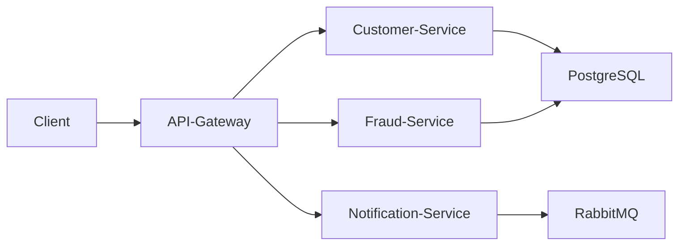

# 🚀 Spring Microservices with Docker & Kubernetes


A **Spring Boot Microservices architecture** deployed using **Docker containers** and orchestrated with **Kubernetes**.

This project demonstrates how to containerize microservices and deploy them to a Kubernetes cluster.

---

# 📚 Table of Contents

- 📖 Project Overview  
- 🏗 Architecture  
- ⚙️ Tech Stack  
- 📂 Project Structure  
- 🚀 Getting Started  
- 🐳 Docker Setup  
- ☸️ Kubernetes Deployment  
- 🧪 API Testing  
- 🤝 Contributing  
- 📄 License  

---

# 📖 Project Overview

This project demonstrates how to build and deploy a **Spring Boot Microservices system** using modern DevOps tools.

Features include:

- Microservice architecture
- Containerized services using Docker
- Kubernetes orchestration
- Service-to-service communication
- Scalable deployment
- Cloud-native architecture

---

# 🏗 Architecture



---

# ⚙️ Tech Stack

### Backend
- Java 21
- Spring Boot
- Spring Web
- Spring Data JPA

### Messaging
- RabbitMQ

### Database
- PostgreSQL

### DevOps
- Docker
- Kubernetes
- Maven

---

# 📂 Project Structure

```
spring_mircoservice-kubernate-docker
│
├── customer-service
│   └── Spring Boot microservice
│
├── fraud-service
│   └── Fraud validation microservice
│
├── notification-service
│   └── RabbitMQ consumer service
│
├── docker
│   └── Docker configuration
│
├── kubernetes
│   └── Kubernetes deployment files
│
└── README.md
```

---

# 🚀 Getting Started

### 1️⃣ Clone Repository

```bash
git clone https://github.com/chunJyi/spring_mircoservice-kubernate-docker.git
cd spring_mircoservice-kubernate-docker
```

---

# 🐳 Build Docker Images

Build the project first:

```bash
mvn clean package
```

Then build Docker images:

```bash
docker build -t customer-service .
docker build -t fraud-service .
docker build -t notification-service .
```

---

# 🐳 Run with Docker Compose

```bash
docker-compose up -d
```

Check running containers:

```bash
docker ps
```

---

# ☸ Kubernetes Deployment

Start Minikube:

```bash
minikube start
```

Apply Kubernetes configurations:

```bash
kubectl apply -f k8s/
```

Check running pods:

```bash
kubectl get pods
```

Check services:

```bash
kubectl get services
```

---

# 🧪 Test API

Example endpoint:

```
POST /api/v1/customers
```

Example request body:

```json
{
  "name": "John",
  "email": "john@example.com"
}
```

---

# 🤝 Contributing

Contributions are welcome.

Steps:

1. Fork the repository

2. Create a new branch

```bash
git checkout -b feature/new-feature
```

3. Commit your changes

```bash
git commit -m "Add new feature"
```

4. Push to GitHub

```bash
git push origin feature/new-feature
```

5. Open a Pull Request

---

# 📄 License

This project is licensed under the **MIT License**.

---

# 👨‍💻 Author

**Chun**

Software Engineer

GitHub:  
https://github.com/chunJyi

---

⭐ If you like this project, please give it a star.
